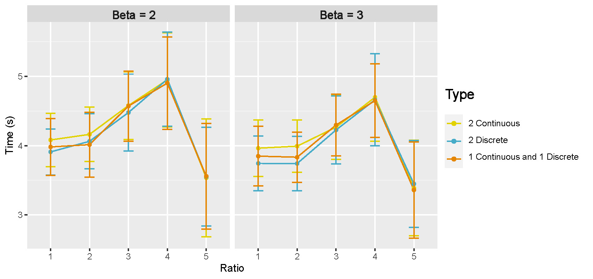
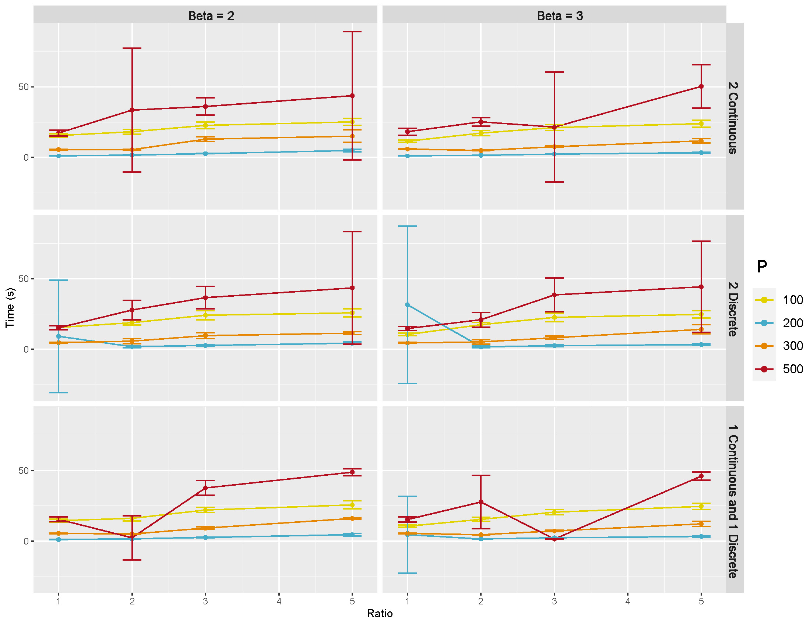

# Simulation studies {#simulation}

```{r, echo=FALSE}
colorize <- function(x, color) {
  if (knitr::is_latex_output()) {
    sprintf("\\textcolor{%s}{%s}", color, x)
  } else if (knitr::is_html_output()) {
    sprintf("<span style='color: %s;'>%s</span>", color,
      x)
  } else x
}
```

<!-- violets are <span style="color:blue">blue</span> -->

In this Section, we provide more simulation results for undirected (Section \@ref(undir)) and directed (Section \@ref(dir)) scenarios with different parameters settings such as: sample size $(n)$, number of nodes $(p)$, number of external covariates $(q)$, type of external covariates, connection probability $(\pi)$, regression coefficients of external covariates $(\beta)$ and etc. 

## Undirected graphical models {#undir}

**Metrics for comparison:** We use the following measures to compare with other methods (I) true positive rate (TPR); (II) false positive rate (FPR); (III) false discovery rate (FDR); (IV) Matthews correlation coefficient (MCC); (V) the area under the receiver operating characteristic (ROC) curve (AUC). MCC [@matthews1975comparison] measures the quality of binary classification, ranging from +1 (perfect classification) to -1 (total mismatch).

**Comparative methods:** We compare the GraphR method with the following methods (I) Bayesian Gaussian graphical models (BGGM, @mohammadi2015bayesian) (II) graphical lasso (GLASSO, @friedman2008sparse) (III) fused graphical lasso (FGL, @danaher2014joint) (IV) group graphical lasso (GGL, @danaher2014joint) (V) Laplacian shrinkage for inverse covariance matrices from heterogeneous populations (LASICH, @saegusa2016joint) (VI) kernel graphical lasso (K-GLASSO, @liu2010graph).

We run BGGM for 10,000 iterations and discard the first 5,000 as burn-in. The tuning parameters of GLASSO is selected based on a stability approach \cite{liu2010stability}. For FGL, GGL, k-GLASSO and LASICH, approximated Akaike Information Criterion (AIC) is used for the choice of tuning parameters. We set the hyperparameters for the GraphR method as $a_\tau = 0.005, b_\tau = 0.005, a_\pi = 1, b_\pi =4$.

### Homogeneous cases {#simhomo}

**Simulation design:** 
We assumed that all individuals are homogeneous, implying $\Omega_n = \Omega$, $\forall$ $n \in \{1,...,151\}$. We only included one constant effect in the external covariate, and generated data as following: 

(I) Generate a Erdős–Rényi graph G by setting connection probability 2\%. If the edge $\{i,j\}$ are connected in G, then the corresponding off-diagonal entries $\omega_{ij} = \omega_{ji}$ are uniformly drawn from $[-1,-0.5] \cup [0.5,1]$ otherwise $\omega_{ij}$ are set to be 0. The diagonal entries  $\omega_{ii}$ are set to be 1. 

(II) The simulated $\Omega$ from \@ref(eq:graph-reg) is not necessarily to be positively definite, and thus we will add $0.1I_{33}$ to $\Omega$ until it is positively definite.

(III) Generate 151 independent observations from $N(0, \Omega^{-1})$ and set external covariates to be intercept only. 

We fix the simulation parameters as $n = 151$, $p = 33$, $q = 1$ (intercept only model), $\pi$ = 5%. 

<!-- **b. Simulation Parameters**  -->

<!-- Fixed: n = 151, p = 33, q = 1 (Intercept only), $\pi$ = 5% -->

**Selection performance:**
Figure \@ref(fig:homosele) shows the selection performance of GraphR and comparison methods by using mean values of AUC, MCC, TPR, FPR and FDR based on 50 repetitions. GraphR performs better than GLASSO except for TPR. BGGM performs marginally better than GraphR in the homogeneous setting. GraphR produces marginally better or at par with reduced level of TPR.    

```{r homosele,echo=F, fig.cap='Selection Performance in homogenuous setting for 5% sparsity level.', out.width='70%', fig.asp=0.6, fig.align='center'}

```

**Computation time:**
Figure \@ref(fig:homotime) shows the mean of computation time in seconds for GraphR and other competitive methods with different levels pf sparsity. The results are based on 50 replications. GraphR is significantly faster than BGGM since GraphR is VB based algorithm whereas BGGM is based on Markov Chain Monte Carlo (MCMC). The frequentist method GLASSO is computationally efficient than GraphR but GLASSO is unable to do the uncertainty quantification.   

```{r homotime,echo=F, fig.cap='Computation times for homogenuous setting with sparsity level at 2% and 5%.', out.width='70%', fig.asp=0.6, fig.align='center'}

```

**Summary:** By design GraphR method is favorable for heterogeneous settings. For the homogeneous setting, GraphR outperforms the frequentist method GLASSO and marginally similar performance with the Bayesian method BGGM at the cost of reduced FDR level. GraphR is computationally efficient than Bayesian methods. The method produces better efficacy rates while enabling uncertainty quantification unlike the frequentist methods.      

### Group specific cases {#simgroupspec}

**Simulation design:** 
The samples were evenly classified into $q$ groups, and each sample had $q$ discrete external covariates, indicating the group allocations. Graphs for different groups were generated as following: 

(I) Graph of the first group $G_1$ was obtained from a Erdos-Renyi graphs with connection probability being $\pi$. 

(II) $G_q$ was constructed by randomly excluding three existing edges and including three new edges from $G_{q-1}$ for $q \geq 2$. 

(III) The precision matrices and observations in three groups were generated in the same way as step (II) in the homogeneous case.


We **fix** the simulation parameters $n = 151$, $p = 33$ and **vary** (I) $q = 2$ (two group indicators) or $q = 3$ (three group indicators); (II) $\pi$ = 2% or 5%. 

**Selection performance:**
Figure \@ref(fig:groupsele) shows the selection performance of GraphR and comparison methods with respect to group-specific graphs (groups 2 and 3) with different sparsity levels (2% and 5%). Mean values of AUC, MCC, TPR, FPR and FDR based on 50 repetitions are reported. The GraphR method performs the best in terms of MCC while producing very similar performance for TPR like other methods under all the simulation settings mentioned in the simulation design. The proposed method takes a hit on TPR to produce the lowest FDR and FPR than any other methods for all the simulation settings. 

```{r groupsele,echo=F, fig.cap='Selection Performance in group-specific setting with varying number of groups and sparsity.', out.width='90%', fig.asp=0.6, fig.align='center'}
knitr::include_graphics("images/group_specific_supp.jpeg")
```

**Computation time:**
Figure \@ref(fig:grouptime) shows the mean of computation time in seconds for GraphR and other competing methods w.r.t. 50 replications along with different groups and sparsity levels. GraphR is more computationally efficient than LASICH for all the settings. The LASSO based methods (FGL and GGL) are marginally faster than GraphR but those methods are unable to quantify uncertainty.

```{r grouptime,echo=F, fig.cap='Computation time(s) in group-specific setting with varying number of groups and varying sparsity.', out.width='90%', fig.asp=0.6, fig.align='center'}
knitr::include_graphics("images/group_time.jpeg")
```

**Summary:** For the group-specific settings, GraphR has marginally similar performance with three comparison methods in terms of AUC. However, in case of other overall performance indicator MCC, GraphR outperforms all other methods. Though GraphR is inferior to comparison methods in TRP, FDR and FPR for GraphR is much lower, which can be viewed as a trade-off. GraphR is also computationally efficient with $<2.5$s computation time on average for all cases.

### Individual-specific cases {#simcont}

**Simulation design:** 
Data were generated based on the assumed model by introducing two continuous external covariates and one intercept. (I) For $i < j$, 2% of coefficients for continuous external covariates $\beta_{ijl}$ were uniformly chose from -1 or 1 while others were set to be 0. Let the corresponding $\beta_{jil}$ equal to $\beta_{ijl}$. Two continuous external covariates were drawn from Uniform $(-1,1)$. We constructed an individual-specific precision matrix $\Omega_n$ by fixing the diagonal entries $\omega_{ii}$ to be 1 and calculating $\omega_{nij} = \sum_{l=1}^2\beta_{nijl}X_{nl}$. (II) Repeat step (I) until $\Omega_n$ is positive definite for all $n$. (III) Generate $y_n$ from $N(0, \Omega_n^{-1})$.  

We set the parameters as $n = 151$, $p = 33$, $q = 2 + 1$ (intercept), $\pi$ = 2%.

**Computation time: **
Figure \@ref(fig:conttime) shows the mean of computation time in seconds of GraphR and comparison methods by based on 50 repetitions. 

```{r conttime,echo=F, fig.cap='Computation time(s) in  individual-specific Case.', out.width='50%', fig.asp=0.6, fig.align='center'}
knitr::include_graphics("images/cont_time.jpeg")
```

**Summary:** Consistent with previous findings, GraphR is computationally efficient than BGGM and k-GLASSO, though takes more computation time than GLASSO. However GLASSO cannot accommodate for heterogenous settings and provide probabilistic reasoning.


## Directed acyclic graphs (DAGs) {#dir}

Here we consider a special case of our GraphR where directions of edges are pre-assumed, leading to a directed acyclic graph model. Three simulation settings are discussed here to illustrate the performance the GraphR method in case of variable selection and scalability for moderate and/or large number of nodes (p) and external covariates (q).

<!-- in which pre-knowledge based directions of edges are assumed, leading to a directed acyclic graph model. -->

**Simulation design:** 
Data was generated as following:

(1) Based on the proposed types of external covariates, we generated continuous external covariates from Uniform(0,1) and discrete external covariates from Bernoulli(0.5). In the settings with large number of external covariates, 70% of external covariates were set to be continuous.

(2) For each external variables, 2% second layer of regression coefficients $\beta_{ij}^{(k)}$ were randomly selected to be non-zero and were set to be 3 when $i > j$. 

(3) The first node ($i=1$) was generated from $N(0,1)$. In terms of $i^{th}$ node $Y_i$ ($i \geq 2$), we standardized $Y_j$ for all $j < i$, and denoted these standardized nodes as $\tilde{Y_j}$. Draw $Y_i$ from Normal distribution with mean being $\sum_{j<i}\left[(\beta_{ij}^{(1)}Z^{(1)} + \beta_{ij}^{(2)}Z^{(2)}) \odot \tilde{Y_j} \right]$ and standard deviation being 1.

We use the same 5 metrics (TPR, FPR, FDR, MCC, AUC) to compare across multiple settings and set the hyperparameters $a_\tau = 0.005, b_\tau = 0.005, a_\pi = 1, b_\pi =1$. The probability cutoff is selected to control the Bayesian FDR at 1%.

<!-- **b. Metrics:** (i) true positive rate (TPR); (ii) false positive rate (FPR); (iii) false discovery rate (FDR); (iv) Matthews correlation coefficient (MCC); (v) the area under the ROC curve (AUC).  -->

<!-- **c. Hyperparameters:** $a_\tau = 0.005, b_\tau = 0.005, a_\pi = 1, b_\pi =1$ -->

<!-- The probability cutoff was selected to control the Bayesian FDR at 1%. -->

### Moderate dimensions {#moderate}

**Simulation parameters:** 
We **fix** the simulation parameters $p = 50$, $q = 2$, $\pi$ $= 2\%$ and **vary** the ratio $n/pq = 1,2,3,4,5$ and type of external covariates (discrete/continuous). 

<!-- *Fixed*: p = 50; q = 2; $\pi$ = 2% -->

<!-- *Varied*: n/pq = 1,2,3,4,5; Type of external covariates -->

**Selection performance:**
Figure \@ref(fig:modext) shows the selection performance of external covariates for the GraphR method in DAG where number of nodes and external covariates are moderate. Each column of the panel indicates types of external covariates while each row represent magnitude of $\beta$. Mean values and 95% confidence interval (CI) of AUC, MCC, TPR, FPR and FDR based on 50 repetitions are reported. 

```{r modext,echo=F, fig.cap='Selection performance in terms of external covariates in directed acyclic graphs with moderate setting.', out.width='100%', fig.asp=0.75, fig.align='center'}

```

Figure \@ref(fig:modnode) shows the edge selection performance of GraphR in the DAG setting where number of nodes and external covariates are moderate. All other settings are same as \@ref(fig:modext). 

```{r modnode,echo=F, fig.cap='Selection performance in terms of edges in directed acyclic graphs with moderate setting.', out.width='100%', fig.asp=0.6, fig.align='center'}

```

The selection performance of GraphR in terms of external covariates and edges is generally better with increasing effect size ($\beta$) and ratio between $n$ and $pq$. However when $n/pq$ ratio is 5, FDR has is slightly larger than the case when $n/pq$ ratio is 3 or 4, leading to decrease in MCC. One of the potential reason is that estimates are local optimum. Moreover, GraphR tended to perform slightly better with more discrete continuous external covariates when $n/pq$ is not large enough.


**Computation times: **
Figure \@ref(fig:modtime) shows the mean and 95% CI of computation time in seconds for GraphR with different types of external covariates and $n/pq$ ratio. Results are based on 50 repetitions. We observe an increasing pattern till the ratio is 4 and a sudden drop at 5, partly due to the fact that convergence to normality is easier to fulfilled with larger sample size.

```{r modtime,echo=F, fig.cap='Computation time in directed acyclic graphs with moderate setting.', out.width='100%', fig.asp=0.6, fig.align='center'}

```


### Large number of nodes {#largep}
**Simulation parameters: ** 
We **fix** the simulation parameters $q = 2$, $\pi$ $= 2\%$ and **vary** the ratio $n/pq = 1,2,3,5$ (i.e. $p=100, 200, 300, 400, 500$), type of external covariates (discrete/continuous) and magnitude of regression coefficients ($\beta=2,3$). 

<!-- *Fixed*: q = 2; $\pi$ = 2% -->

<!-- *Varied*: p = 100, 200, 300, 500; n/pq = 1,2,3,4,5; Type of external covariates; $\beta = 2$ or $3$ -->

**Selection performance: **
Figure \@ref(fig:highpext) and \@ref(fig:highpnode) show the selection performance of GraphR in terms of external covariates and edges in directed acyclic graphs. Number of nodes are set to be 100, 200, 300 and 500 as shown on the top of each plot. Other settings are same as \@ref(fig:modext) and \@ref(fig:modnode). 

```{r highpext,echo=F, fig.cap='Selection performance in terms of external covariates in directed acyclic graphs with large number of nodes.', out.width='100%', fig.asp=0.6, fig.align='center'}
knitr::include_graphics("images/highp_ext.jpeg")
```

```{r highpnode,echo=F, fig.cap='Selection performance in terms of edges in directed acyclic graphs with large number of nodes.', out.width='100%', fig.asp=0.6, fig.align='center'}
knitr::include_graphics("images/highp_node.jpeg")
```

Generally, we can observe an increasing trend in AUC, MCC and TPR and decreasing trend in FDR and FPR with larger $n/pq$ ratio and effect size which is similar as the pattern in the moderate setting. However, there are some exception. For example when number of nodes is 500, there is a sudden jump of FDR at $n/pq=3$ with relatively large standard deviation, which also can be reflected the decrease in MCC. This phenomena might be caused by some cases where only local optimum are found.


**Computation times: **
Figure \@ref(fig:highptime) shows the mean and 95% CI of computation time in seconds of GraphR based on 50 repetitions. Each row of panel represent types of external covariates while each column indicates the magnitude of coefficients. Number of nodes are set to be 100, 200, 300 and 500, represented by different colors. In most of the cases, longer computation times are needed when sample size and number of nodes increase.

```{r highptime,echo=F, fig.cap='Computation time in directed acyclic graphs with large number of nodes.', out.width='100%', fig.asp=0.6, fig.align='center'}

```


### Large number of external covariates {#largeq}
**Simulation parameters:** We **fix** the simulation parameters $p = 50$, $\pi$ $= 2\%$, and 70% of external covariates are set to be continuous. We also **vary** the ratio $q = 2,5,10$, $n/pq = 1,2,3,5$ and magnitude of regression coefficients ($\beta=2,3$). 

**Selection performance: **
Figure \@ref(fig:largeqext) and \@ref(fig:largeqnode) show the selection performance of GraphR in terms of external covariates and nodes in directed acyclic graphs. Number of external covariates are set to be 2, 5 and 10 and 70% of covariates are continuous. Other settings are same as \@ref(fig:modext) and \@ref(fig:modnode). 

```{r largeqext,echo=F, fig.cap='Selection performance in terms of external covariates in directed acyclic graphs with large number of external covariates.', out.width='100%', fig.asp=0.6, fig.align='center'}
knitr::include_graphics("images/highq_ext.jpeg")
```

```{r largeqnode,echo=F, fig.cap='Selection performance in terms of edges in directed acyclic graphs with large number of external covariates.', out.width='100%', fig.asp=0.6, fig.align='center'}
knitr::include_graphics("images/highq_node.jpeg")
```

Similar as previous findings, GraphR performs better with larger $n/pq$ ratio and effect size. Importantly, the accuracy of selection also decreases when q is relatively large, suggesting that higher $n/pq$ is needed in order to ensure the quality of estimation.


**Computation time: **
Figure \@ref(fig:HighqTime) shows the mean and 95% CI of computation time in seconds for GraphR based on 50 repetitions. Number of external covariates are set to be 2, 5 and 10, represented by different colors. 
```{r HighqTime,echo=F, fig.cap='Computation time in directed acyclic graphs with large number of external covariates.', out.width='100%', fig.asp=0.6, fig.align='center'}
knitr::include_graphics("images/highq_time.jpeg")
```

Computation time increase with larger number of external covariates regardless of the effect sizes. Moreover, variability are also greater when number of external covariates are larger.